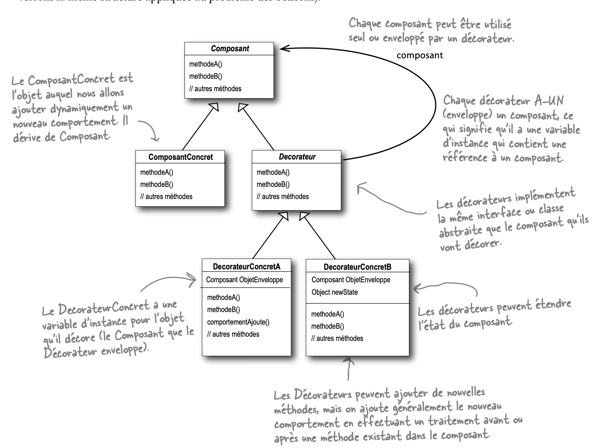

# Decorator

## Nom du patron

**Decorator** (Décorateur) — Patron de **structure**

---

## Intention

Le patron Decorator permet d'ajouter dynamiquement de nouveaux comportements à un objet en l'enveloppant dans des objets "décorateurs". C'est une alternative flexible à l'héritage pour étendre les fonctionnalités d'un objet sans modifier sa classe.

---

## Problème

Imaginons une pizzeria. Au départ on a une `PizzaMargarita`. Puis les clients veulent personnaliser : ajouter du jambon, des champignons, des olives, du fromage supplémentaire...

Avec l'héritage, chaque combinaison devient une sous-classe :
`PizzaMargaritaJambon`, `PizzaMargaritaChampignons`, `PizzaMargaritaJambonChampignons`, `PizzaMargaritaJambonOlives`...

Avec 4 ingrédients possibles, on arrive à **16 combinaisons**. Avec 10 ingrédients, c'est ingérable. C'est l'**explosion combinatoire de sous-classes**.

De plus, le prix et la description de la pizza doivent refléter exactement les ingrédients choisis — impossible à gérer proprement avec l'héritage.

**Le problème central** : comment ajouter des responsabilités à un objet de façon flexible et combinable, sans toucher à sa classe ni créer une sous-classe par combinaison ?

---

## Solution

Au lieu d'hériter, on **enveloppe** l'objet dans un décorateur. Le décorateur implémente la même interface que l'objet original, contient une référence vers lui, et ajoute son comportement avant ou après avoir délégué l'appel.

On peut empiler plusieurs décorateurs les uns dans les autres : chaque couche ajoute sa contribution, et l'appel se propage à travers toutes les couches.

```
AvecOlives( AvecJambon( AvecChampignons( PizzaMargarita ) ) )
```

---

## Structure (rôles des classes)

| Rôle | Responsabilité |
|---|---|
| **Composant** | Définit l'interface commune aux objets de base et aux décorateurs — peut être une interface ou une classe abstraite |
| **Composant Concret** | L'objet de base à décorer — implémente le comportement par défaut |
| **Décorateur de Base** | Classe abstraite qui implémente l'interface et contient une référence vers un composant ; délègue les appels |
| **Décorateurs Concrets** | Étendent le Décorateur de Base et ajoutent leur comportement avant ou après la délégation |
| **Client** | Assemble les couches de décorateurs et travaille avec l'objet via l'interface commune |



> Le Décorateur de Base est la clé : il hérite du Composant (même interface) **et** contient une référence vers un Composant (composition). C'est cette double relation qui permet d'empiler les décorateurs indéfiniment.

---

## Applicabilité

Utiliser Decorator quand :

- **On veut ajouter des comportements à des objets à l'exécution** sans modifier leur code source.
- **L'héritage produirait une explosion de sous-classes** pour couvrir toutes les combinaisons possibles.
- **On veut pouvoir combiner plusieurs extensions** indépendamment les unes des autres.
- **La classe à étendre est `final`** et ne peut donc pas être sous-classée.

---

## Avantages

- **Pas d'explosion de sous-classes** : on combine les décorateurs au lieu de créer une classe par combinaison.
- **Composition dynamique** : on ajoute ou retire des comportements à l'exécution.
- **Principe de Responsabilité Unique** : chaque décorateur gère un seul comportement supplémentaire.
- **Principe Ouvert/Fermé** : on étend les fonctionnalités sans toucher au code existant.

---

## Inconvénients

- **Ordre des décorateurs important** : le résultat peut varier selon l'ordre dans lequel on empile les décorateurs.
- **Retirer un décorateur précis est difficile** : si on a 5 couches, on ne peut pas facilement en supprimer une au milieu.
- **Multiplication des petits objets** : beaucoup de décorateurs peuvent rendre le code difficile à lire si mal organisé.

---

## Cas d'usage réel

**Pizzeria en ligne** : le client choisit une base, puis ajoute des ingrédients un par un. Chaque ingrédient enveloppe la pizza et contribue à la description finale et au prix total.

- Interface : `Pizza` avec `getDescription()` et `getPrix()`
- Composant concret : `PizzaMargarita` — base à 8,50€
- Décorateur de base : `DecoratorIngredient` — délègue à la pizza enveloppée
- Décorateurs concrets : `AvecJambon` (+1,50€), `AvecChampignons` (+1,00€), `AvecOlives` (+0,80€), `AvecFromage` (+1,20€)
- Client : assemble les couches selon le choix du client

```
// Pizza avec jambon et champignons
Pizza commande = new AvecChampignons(new AvecJambon(new PizzaMargarita()));
// -> "Pizza Margarita, jambon, champignons" pour 11,00€
```

Ajouter demain un ingrédient "Artichauts" ? On crée `AvecArtichauts` — aucune autre classe n'est touchée.

---
